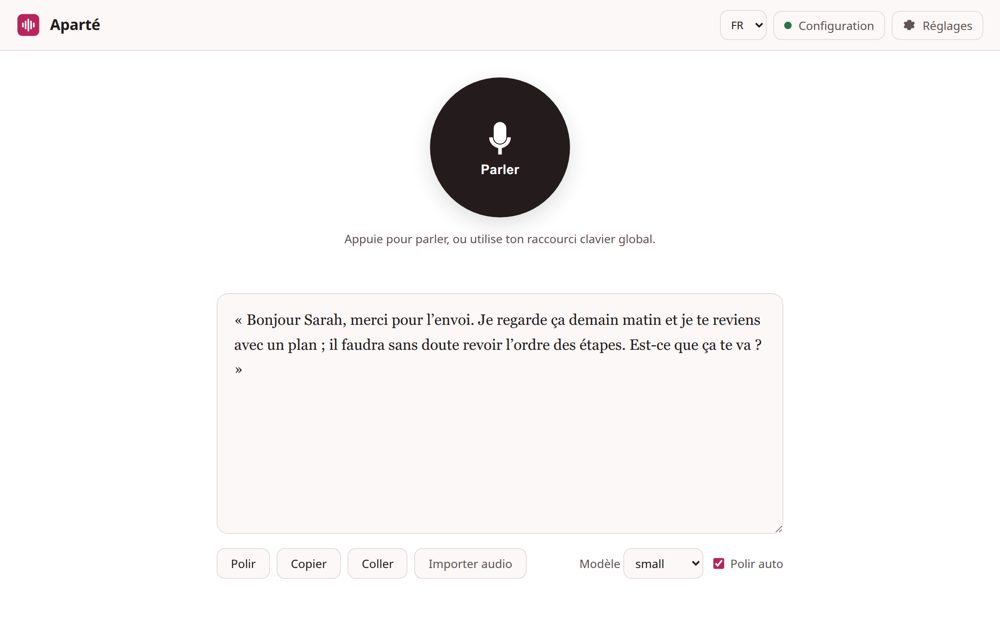
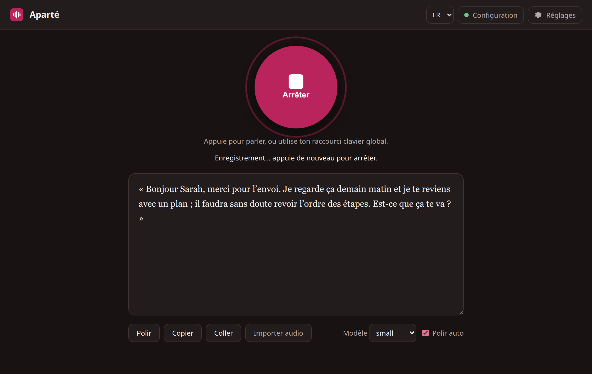
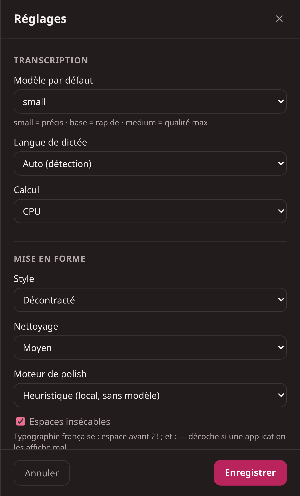
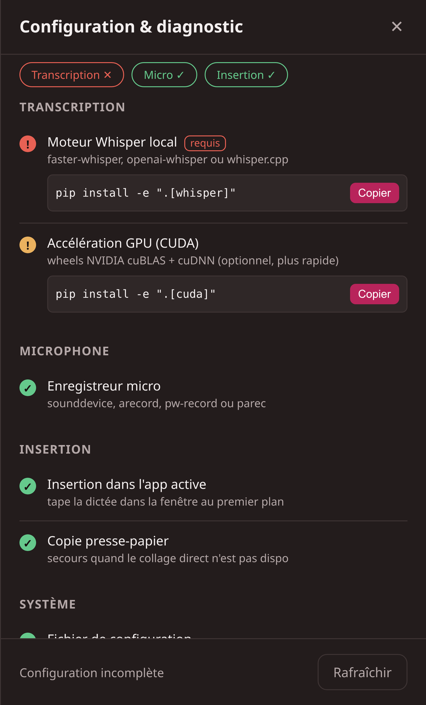

# Aparté

> ### 👋 Looking for **Murmur**? You found it.
>
> This project was called **Murmur** until it was renamed to **Aparté**, to avoid
> confusion with the unrelated [Murmure](https://github.com/Kieirra/murmure)
> project. Same repository, same app, new name.
>
> Already running Murmur? Nothing breaks: your config is migrated automatically,
> `MURMUR_*` environment variables still work, and the old `murmur` command still
> launches Aparté — so a global shortcut bound to it keeps working. See
> [Upgrading from Murmur](#upgrading-from-murmur-the-previous-name).

[](https://github.com/collectifweb/aparte/actions/workflows/ci.yml)
[](LICENSE)

Aparté is a local-first dictation app for Linux. It can run as a CLI, as a command bound to a global keyboard shortcut, or as a lightweight local desktop web app.

Nothing leaves your machine: Whisper runs locally, formatting runs locally, and
there is no account, no API key, and no network call. It is also the only
dictation app that takes **French typography** seriously — non-breaking spaces
before `? ! ; :`, real `« »` quotes, curly apostrophes.

The first version focuses on the core Flow-like loop:

1. Capture speech or accept an audio file.
2. Transcribe with a local Whisper backend.
3. Polish the raw transcript with punctuation, capitalization, filler cleanup, lists, and optional local LLM formatting.
4. Copy or paste the result into the active Linux desktop session.

## Screenshots



One screen: a Talk button, a transcript editor, and nothing else in the way. The
transcript is set in a serif face, so the French typography Aparté produces is
actually visible — look at the `« »`, the curly apostrophes, and the spacing
before `;` and `?`.



Aparté follows your desktop's light or dark theme. While the microphone is open,
the button is the only saturated thing on screen — you can tell it is recording
from the corner of your eye, and without relying on colour alone (the icon and
the label change too).

Grouped settings and built-in setup diagnostics — the diagnostics show what is
installed and the exact command to fix anything missing, so any Linux user can
get set up without the terminal. The interface is available in English and French.

<p>
  
  
</p>

## Current status

This repo is a working MVP scaffold. It runs immediately for text polishing and desktop UI. Audio transcription activates when one of these local backends is available:

- `faster-whisper` Python package
- `openai-whisper` Python package
- `whisper.cpp` CLI via `APARTE_WHISPER_CPP`

For best formatting quality, run Ollama locally and set `APARTE_POLISH_BACKEND=ollama`.
For consistent spelling of names, products, acronyms, and repeated phrases, use the built-in config file.

## Install

Two ways to install. The script is the easy path; the manual venv install gives you more control.

### Option A — guided script (recommended)

```bash
git clone https://github.com/collectifweb/aparte.git
cd aparte
./scripts/install-linux.sh                       # Whisper + recording + default config + desktop launcher (icon/menu)
./scripts/install-linux.sh --with-system-deps    # also apt-installs the recording/clipboard/paste tools
```

The script auto-adds GPU support (the `cuda` extra) when it detects an NVIDIA GPU,
and registers the desktop icon/menu entry for you.

### Option B — manual venv install

```bash
git clone https://github.com/collectifweb/aparte.git
cd aparte
python3 -m venv .venv
source .venv/bin/activate
python -m pip install -e ".[whisper,recording]"  # add ,cuda for NVIDIA GPUs — see "GPU acceleration" below
```

This `[whisper,recording]` baseline is what makes Aparté an actual dictation app:
`whisper` enables transcription and `recording` enables microphone capture. A bare
`pip install -e .` only gives you text polishing and the desktop UI — it cannot
transcribe or record.

Then verify the setup and install the desktop launcher (the manual path does **not**
add the icon/menu entry by itself — only `install-linux.sh` does):

```bash
aparte doctor            # green/red status for every dependency, with the fix command for each gap
aparte install-desktop   # add the app icon + menu entry (use --print to preview the entry first)
```

### Updating an existing install

To upgrade, pull the latest code **in the folder you already cloned** and re-run
the script — don't clone a second copy:

```bash
cd aparte          # the directory you installed into
git pull
./scripts/install-linux.sh
```

Re-running is safe: the existing `.venv` is reused, dependencies are upgraded in
place, and config init is a no-op. Cloning Aparté again into a new folder instead
leaves you with two separate installs (each with its own multi-GB `.venv`) and a
desktop launcher and autostart entry that can point at different copies.

On a manual venv install (Option B), update with:

```bash
cd aparte
git pull
source .venv/bin/activate
python -m pip install -e ".[whisper,recording]"   # add ,cuda for NVIDIA GPUs
```

> If `git pull` reports *"no tracking information for the current branch"*, you're
> on a local branch that was never pushed. Switch to `main` first
> (`git checkout main`), then pull.

### Upgrading from Murmur (the previous name)

Pull and re-run the install script as above; the rename is handled for you:

- `~/.config/murmur/config.json` is moved to `~/.config/aparte/config.json` on
  first run, so your settings, replacements, and snippets carry over.
- `MURMUR_*` environment variables are still read as a fallback, so existing
  shell profiles and scripts keep working.
- The old `murmur` command still runs Aparté, so a global shortcut bound to the
  old binary keeps working. It is deprecated and will be removed later — re-run
  `aparte install-hotkey` to repoint the shortcut at the new command.
- The old desktop launcher, icon, and autostart entry are removed when you
  re-run `aparte install-desktop` / `aparte install-autostart`, so you don't end
  up with two menu entries or two servers competing at login.

### Extras, à la carte

| Extra        | Adds                                                                  |
|--------------|-----------------------------------------------------------------------|
| `whisper`    | `faster-whisper` transcription backend (required for dictation)       |
| `recording`  | microphone capture via `sounddevice` (required for live dictation)    |
| `cuda`       | NVIDIA GPU acceleration — see *GPU acceleration* below                |

### System packages

```bash
sudo apt install alsa-utils ffmpeg wl-clipboard wtype xclip xdotool
```

Use Wayland tools (`wl-copy`, `wtype`) on Wayland, or X11 tools (`xclip`, `xdotool`) on X11.

### GPU acceleration (NVIDIA, optional)

```bash
python -m pip install -e ".[whisper,recording,cuda]"
```

This installs the CUDA runtime libraries as pip wheels **inside the venv** — no
system CUDA toolkit and no driver changes, so it will not touch the GPU drivers your
games or other apps rely on. The app preloads the libraries automatically, so GPU
transcription works without setting `LD_LIBRARY_PATH`, and **falls back to CPU
automatically** when CUDA is unusable.

Confirm the GPU is actually used (not merely installed):

```bash
.venv/bin/python -c "import ctranslate2; print(ctranslate2.get_cuda_device_count())"
```

`> 0` means the GPU will be used; `0` means CPU fallback. Note that `aparte doctor`'s
"GPU acceleration (CUDA): ok" only confirms the CUDA libraries are importable — not
that a device is reachable at runtime. Use the command above, or watch `nvidia-smi`
during a dictation, to be sure. On older cards (Pascal / GTX 10-series), set
`APARTE_COMPUTE_TYPE=int8`: the `auto` default picks `float16`, which is slow on those
GPUs.

## CLI examples

Polish raw text:

```bash
echo "hey sarah thanks for sending this euh i will review it tomorrow" | aparte polish
```

Transcribe an audio file and polish it:

```bash
aparte transcribe meeting.wav --polish
```

Record from the microphone, transcribe, polish, and copy:

```bash
aparte record --seconds 15 --polish --copy
```

Dictate directly into the active app:

```bash
aparte dictate --seconds 8
```

Use fixed-duration dictation as a global keyboard shortcut command in GNOME/KDE/XFCE:

```bash
aparte dictate --seconds 8 --target paste
```

For a more Flow-like shortcut, bind the same toggle command to one global hotkey. The first press starts recording; the second press stops, transcribes, polishes, and inserts:

```bash
aparte toggle --target paste
```

Check whether a toggle recording is already active:

```bash
aparte toggle --status
```

If direct paste is unavailable on your desktop, copy instead:

```bash
aparte toggle --target copy
```

Launch the Linux desktop app:

```bash
aparte desktop
```

Install a desktop launcher in `~/.local/share/applications`:

```bash
aparte install-desktop
```

Run the desktop server automatically at login (writes `~/.config/autostart`).
It starts in the background without opening a browser, so the editor and the
Settings tab are always available at `http://127.0.0.1:8765`:

```bash
aparte install-autostart
aparte install-autostart --remove   # undo
```

## Global hotkey (recommended for dictating into other apps)

The Flow-like flow is one global shortcut bound to `toggle`: press once to start,
press again to transcribe and insert into whatever app is focused (Slack, email,
…). The binding is stored by your desktop and survives reboots, so no background
process is required for it.

On Cinnamon and GNOME, Aparté can register the shortcut for you:

```bash
aparte install-hotkey                            # bind Super+Space to toggle dictation
aparte install-hotkey --key '<Control><Alt>d'    # pick another accelerator
aparte install-hotkey --print                    # show what it would bind, without applying
aparte install-hotkey --remove                   # remove it
```

It allocates a custom keybinding through `gsettings`, reusing the same slot on
re-runs so it never piles up duplicates. A bare `install-hotkey` keeps an
already-chosen key; only `--key` moves it.

On other desktops, add the shortcut yourself (System Settings → Keyboard →
Shortcuts → Custom Shortcuts → Add) with this command — use the full path to the
binary inside your venv:

```bash
/path/to/aparte/.venv/bin/aparte toggle --target paste
```

Then assign a key (e.g. a spare key or `Super+Space`). Direct paste needs
`xdotool` on X11 or `wtype` on Wayland; otherwise use `--target copy` and paste
with `Ctrl+V`. Desktop notifications show when recording starts and stops.

Open **Setup** in `aparte desktop` to check the binding: the **Keyboard
shortcut** card shows whether the shortcut is bound and to which key, the
one-command auto-bind, and the exact `toggle` command to bind by hand — each with
a copy button.

Create and inspect your config:

```bash
aparte config init     # write a default config.json
aparte config path     # print its location
aparte config show     # print the active (merged) config
```

There is no `config set` command. To change settings persistently, edit the JSON
file printed by `aparte config path`, or use the **Settings** panel in `aparte
desktop` — it writes to the same file and applies immediately, including to the
global-hotkey flow.

## Configuration

Environment variables:

```bash
APARTE_TRANSCRIBER=auto
APARTE_RECORDER=auto
APARTE_MODEL=small
APARTE_DEVICE=auto
APARTE_COMPUTE_TYPE=auto
APARTE_LANGUAGE=
APARTE_POLISH_BACKEND=heuristic
APARTE_OLLAMA_URL=http://127.0.0.1:11434
APARTE_OLLAMA_MODEL=llama3.1:8b
APARTE_WHISPER_CPP=
APARTE_CONFIG=
```

`APARTE_DEVICE` controls the `faster-whisper` compute device (`auto`, `cpu`, or `cuda`).
When a GPU is detected but its CUDA runtime is missing or unusable
(`libcublas`/`libcudnn` not found), transcription automatically falls back to CPU
with `int8`, so it works out of the box on machines without a CUDA install.
Force CPU with `APARTE_DEVICE=cpu` to skip the GPU probe entirely.

Polish backends:

- `heuristic`: fully local, no model required, good enough for punctuation and capitalization cleanup.
- `ollama`: local LLM rewrite through Ollama, much better for fillers, backtracking, tone, and context.

### French typography

Aparté is built for dictating in French, so the formatting rules follow French
typography rather than the English ones:

- a non-breaking space before `? ! ;` and `:` — but not inside `https://` or `14:30`
- `«  »` instead of straight double quotes, when they pair up
- a typographic apostrophe: `l'ami` → `l’ami`
- standalone `i` is left alone (upper-casing it is the English pronoun rule)

Which set applies follows the **Dictation language** setting. On `Auto`, the
language is guessed from the text itself, so French typography works without
setting anything — but pinning the setting to `Français` is more reliable, and
it also stops Whisper from drifting to another language.

Set `"nonbreaking_spaces": false` in the config to use ordinary spaces instead of
non-breaking ones, for apps that handle them poorly.

Recorder backends:

- `auto`: try Python `sounddevice`, then `arecord`.
- `sounddevice`: Python recording backend.
- `arecord`: ALSA command-line recorder from `alsa-utils`.

Persistent config lives at `${XDG_CONFIG_HOME}/aparte/config.json`, or `~/.config/aparte/config.json` when `XDG_CONFIG_HOME` is not set. Override it with `APARTE_CONFIG=/path/to/config.json`.

Example:

```json
{
  "default_style": "neutral",
  "cleanup_level": "medium",
  "language": "en",
  "replacements": {
    "whisper flow": "Wispr Flow",
    "pipe wire": "PipeWire",
    "my project": "MyProject"
  },
  "snippets": {
    "signature": "Best,\nAlexandre"
  }
}
```

With that config, dictating `slash signature` expands the snippet, and dictated terms such as `pipe wire` are rewritten with the preferred spelling.

## Desktop app

`aparte desktop` starts a local server on `127.0.0.1` and opens the browser. The
interface is a focused, single-screen app:

- a large **Talk** button (browser microphone recording as WAV PCM, so no hard
  dependency on `ffmpeg`) that records, transcribes, and auto-polishes
- a transcript editor with **Polish**, **Copy**, **Paste**, and audio import
- a model toggle (`small` = accurate, `base` = fast); each model loads once and
  is cached, so switching is instant after first use
- a **Settings** panel (gear icon) grouped into Transcription (model, language,
  compute device), Formatting (style, cleanup, polish backend), and Vocabulary
  (replacements, snippets) — saved to the config file and applied immediately,
  including to the global-hotkey dictation flow
- a **Configuration & diagnostics** panel that shows, with green/red status, what
  is installed vs missing (Whisper backend, GPU, microphone, paste/clipboard,
  notifications) and the exact command to fix each gap — copy-paste onboarding
  for any Linux user

The interface is bilingual (English / French) with a language switch in the top
bar; it defaults to the browser language. It follows your desktop's light or dark
theme automatically, and the whole keyboard path works: `Tab` reaches every
control with a visible focus ring, `Esc` closes a panel, and animations are
skipped when your system asks for reduced motion.

The frontend lives in `src/aparte/assets/` (`index.html`, `app.css`, `app.js`,
`i18n.js`, `logo.svg`) and is served as static files, with **no build step and no
library**, so it is easy to contribute to. The design system it follows is
documented in [DESIGN.md](DESIGN.md), and the product direction behind it in
[PRODUCT.md](PRODUCT.md).

## Desktop notifications

The hotkey dictation flow (`toggle` and `dictate`) shows native Linux
notifications via `notify-send` so you can tell when recording starts, when
transcription is running, and when text was inserted or copied — useful when the
command is bound to a global shortcut and no terminal is visible. Install it with
`sudo apt install libnotify-bin` if `notify-send` is missing; it is optional and
dictation works without it.

This approach avoids GTK/Qt packaging friction while staying Linux-compatible.

## Contributing

Contributions are welcome — see [CONTRIBUTING.md](CONTRIBUTING.md) for the
development setup, how to run the tests, and the code layout. The desktop UI is
plain HTML/CSS/JS in `src/aparte/assets/` with no build step.

## License

Aparté is released under the [MIT License](LICENSE). It is an independent,
open-source project, not affiliated with the commercial Wispr Flow product, nor
with the similarly named [Murmure](https://github.com/Kieirra/murmure) project.
